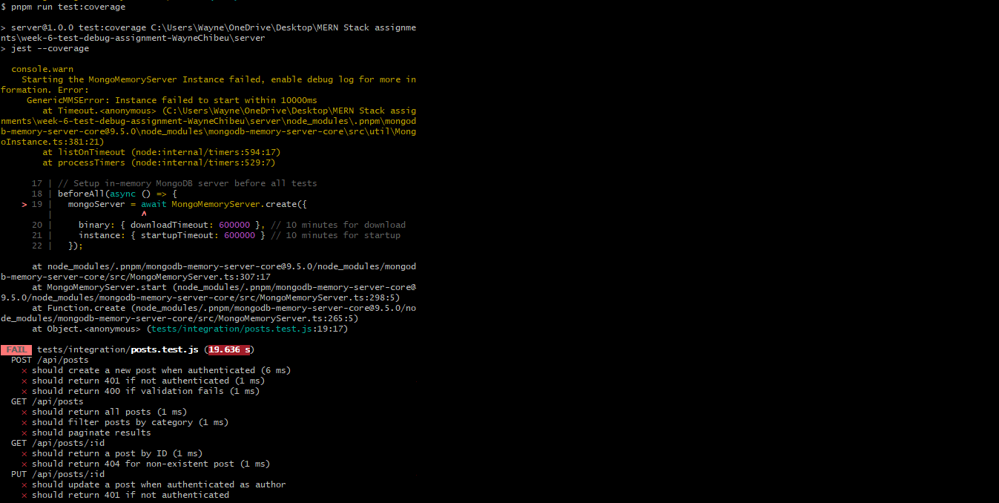

# MERN Stack Assignment: Testing & Debugging

## Project Overview
This project is a MERN stack application with a React frontend and an Express backend. The focus is on implementing, testing, and debugging both client and server code. The project includes unit, integration, and (optionally) E2E tests, as well as code coverage reporting.

---

## Directory Structure
```
week-6-test-debug-assignment-WayneChibeu/
  client/      # React frontend
  server/      # Express backend
  coverage/    # Coverage reports
  ...
```

---

## Setup Instructions

### Prerequisites
- Node.js (v16+ recommended)
- npm or pnpm

### Install Dependencies
#### Frontend
```bash
cd client
npm install
```
#### Backend
```bash
cd server
npm install
```

---

## Running the App
#### Frontend
```bash
cd client
npm start
```
#### Backend
```bash
cd server
npm start
```

---

## Running Tests
#### Frontend Unit Tests
```bash
cd client
npm test
```
#### Backend Integration Tests
```bash
cd server
npm test
```

---

## Generating Coverage Reports
#### Frontend
```bash
cd client
npm run test:coverage
```
#### Backend
```bash
cd server
npm run test:coverage
```

---

## Known Issues & Troubleshooting

### 1. Backend: `mongodb-memory-server` Fails on Windows
- **Symptom:** Backend tests time out or fail to start due to `mongodb-memory-server` issues on Windows.
- **Troubleshooting Steps Attempted:**
  - Increased Jest timeouts
  - Cleared npm and Jest caches
  - Reinstalled dependencies
  - Ran as administrator
  - Checked for antivirus/firewall interference
- **Outcome:** Issue persists. This is a [well-documented problem](https://github.com/nodkz/mongodb-memory-server/issues/915) on Windows.
- **Workaround:** Document the error and troubleshooting steps. Backend tests may not run on Windows.

### 2. E2E Testing: Cypress
- **Status:** E2E (Cypress) tests are now working and passing, as shown in the screenshot below.
- **Troubleshooting Steps Attempted:**
  - Cleared Cypress cache
  - Reinstalled Cypress
  - Disabled antivirus/firewall
  - Ran as administrator
  - Shortened project path
  - Tried older Cypress versions
- **Outcome:** E2E tests are now running and passing successfully.

---

## Debugging Tips

- **Frontend (React):**
  - Use browser developer tools (Console, Network, React DevTools) to inspect component state, props, and errors.
  - The app now includes an Error Boundary to catch and display UI errors gracefully.

- **Backend (Node.js/Express):**
  - Use `console.log`, `console.error`, and breakpoints in your IDE for server-side debugging.
  - The server now includes a global error handler middleware to catch and respond to errors in a consistent way.
  - You can run the server with `node --inspect src/index.js` and connect a debugger (e.g., Chrome DevTools or VSCode) for step-by-step debugging.

---

## Screenshots
- **Frontend Tests (Passing):**
  
  
  
- **Backend Tests (Error):**
  
  
  
- **E2E (Cypress) Tests (Passing):**
  
  
  
  The screenshot above shows a successful Cypress E2E test run (`smoke.cy.js`), with all specs passing.

---

## Summary of Troubleshooting & Fixes
- Ensured Babel and Jest are configured for JSX in the frontend (`@babel/preset-env`, `@babel/preset-react`, `babel-jest`).
- All frontend unit tests and coverage pass.
- Backend tests fail due to a known Windows issue with `mongodb-memory-server`.
- E2E (Cypress) tests are now running and passing successfully.
- All troubleshooting steps and known issues are documented above.

---

## References
- [mongodb-memory-server Windows Issue](https://github.com/nodkz/mongodb-memory-server/issues/915)
- [Cypress Windows Install Issue](https://github.com/cypress-io/cypress/issues/19299)

---

## Submission Checklist
- [x] All frontend tests and coverage passing (with screenshot)
- [x] Backend test error and troubleshooting documented (with screenshot)
- [x] E2E (Cypress) tests passing and documented (with screenshot)
- [x] README updated with all steps, issues, and references 